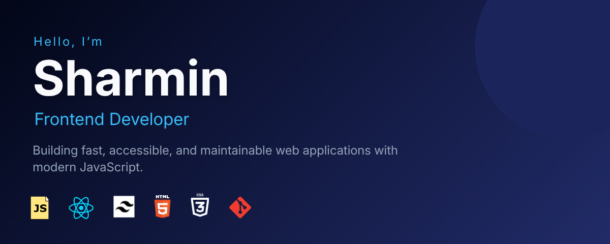

<!--
**webwizsharmin/webwizsharmin** is a ✨ _special_ ✨ repository because its `README.md` (this file) appears on your GitHub profile.

Here are some ideas to get you started:

- 🔭 I’m currently working on ...
- 🌱 I’m currently learning ...
- 👯 I’m looking to collaborate on ...
- 🤔 I’m looking for help with ...
- 💬 Ask me about ...
- 📫 How to reach me: ...
- 😄 Pronouns: ...
- ⚡ Fun fact: ...
-->

<!-- Banner -->

# 👋 Hi, I'm Sharmin

Frontend Developer focused on building modern, responsive, and maintainable web applications.

I enjoy transforming ideas into intuitive user experiences through clean architecture, thoughtful design, and scalable JavaScript. Currently, I’m expanding my frontend expertise by learning React while continuously improving my problem‑solving and software engineering skills.

---

## 📌 About Me

- 💻 Frontend Developer passionate about building production‑ready web applications
- ⚡ Strong foundation in HTML, CSS, JavaScript, Tailwind CSS, and Vite
- 🧩 Enjoy writing modular, maintainable, and reusable code
- 📱 Focused on responsive design, accessibility, and performance
- 🌱 Currently learning React to build scalable modern applications
- 🎯 Actively working toward remote Frontend Developer opportunities

---

## 🛠 Tech Stack

### Frontend

- HTML5
- CSS3
- JavaScript (ES6+)
- Tailwind CSS

### Development Tools

- Git
- GitHub
- Vite
- npm

### Currently Exploring

- React
- Frontend Architecture
- Performance Optimization

---

## 📂 Featured Projects

### ClientFlow

A modern CRM‑style client management app built with **Tailwind CLI** and **modular JavaScript**.

Includes CRUD operations, a Kanban board with drag‑and‑drop tasks, dark/light theme switcher, localStorage persistence, and a fully responsive UI.

**Tech Stack:** JavaScript (ES6+), Tailwind CSS (CLI), HTML5, CSS3

🔗 [Live Demo](https://6a40c418d1723ce37d4f4294--incandescent-cobbler-823a8b.netlify.app/)  
🔗 [Source Code](https://github.com/webwizsharmin/clientflow)

---

### Portfolio

A modern developer portfolio showcasing projects, technical skills, and my development journey.  
Built with a strong focus on performance, accessibility, and responsive design.

**Tech Stack:** HTML • Tailwind CSS • JavaScript • Vite

🔗 [Live Demo](https://portfolio-eta-tawny-32.vercel.app/)  
🔗 [Source Code](https://github.com/webwizsharmin/portfolio)

---

### Business Coach Landing Page

A responsive, marketing‑focused landing page designed for a business coach.  
Features a clean layout, modern UI, and optimized user experience across all devices.

**Tech Stack:** JavaScript, Tailwind CSS (CLI), HTML5, CSS3

🔗 [Live Demo](https://webwizsharmin.github.io/business-coach-landing-page/)  
🔗 [Source Code](https://github.com/webwizsharmin/business-coach-landing-page)

---

## 📚 Currently Learning

- React fundamentals & modern patterns
- API integration for dynamic applications
- Frontend performance optimization
- Writing scalable and maintainable frontend architectures

---

## 📊 GitHub Stats

---

## 🤝 Let's Connect

