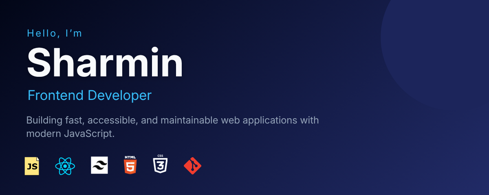

<!--
**webwizsharmin/webwizsharmin** is a ✨ _special_ ✨ repository because its `README.md` (this file) appears on your GitHub profile.

Here are some ideas to get you started:

- 🔭 I’m currently working on ...
- 🌱 I’m currently learning ...
- 👯 I’m looking to collaborate on ...
- 🤔 I’m looking for help with ...
- 💬 Ask me about ...
- 📫 How to reach me: ...
- 😄 Pronouns: ...
- ⚡ Fun fact: ...
-->

<!-- Banner -->

# 👋 Hi, I'm Sharmin

Frontend Developer focused on building modern, responsive, and production ready web applications.

I enjoy transforming ideas into intuitive user experiences through clean architecture, scalable React components, and thoughtful design. Currently, I’m expanding my frontend expertise with React, TypeScript, and Next.js while continuously improving my problem‑solving and software engineering skills.

---

## 📌 About Me

- 💻 Frontend Developer passionate about building SaaS style Production ready application with React and Tailwind (Vite)
- ⚡ Strong foundation in HTML, CSS, JavaScript (ES6+), TailwindCSS, and modern frontend tooling
- 📊 Experienced in integrating data visualization with Recharts
- 🧩 Skilled at writing modular, maintainable, and reusable components
- 📱 Focused on responsive design, accessibility, and performance optimization
- 🌱 Currently exploring TypeScript, Next.js and Node.js for fullstack capabilities
- 🎯 Actively working toward remote Frontend Developer opportunities

---

## 🛠 Tech Stack

### Frontend

- React (Hooks, Context, Component Architecture)
- TailwindCSS (with Vite)
- JavaScript (ES6+)
- Recharts (data visualization)
- clsx (conditional class management)
- CSS3
- HTML5

### Development Tools

- Git
- GitHub
- Vite
- npm
- Netlify & Vercel (deployment)

### Currently Exploring

- TypeScript (for scalable, type-safe React apps)
- Next.js (for production-grade React projects with SSR/SSG)
- Node.js (for backend APIs and full-stack applications)
- Frontend Architecture & Design patterns
- Performance Optimization

---

## 📂 Featured Projects

### Clientflow-v2

A modern CRM-style SaaS dashboard built with **React**, **TailwindCSS(vite)**, and **Recharts**.

Features include responsive dashboard UI, Client management with CRUD operations, realistic authentication flow, and chart visualizations.

Built to demonstrate production-ready React component architecture and scalable frontend patterns.

**Tech Stack:** React, TailwindCSS (vite), Recharts, clsx, JavaScript (ES6+)

🔗 [Live Demo](https://clientflow-v2-1sgq.vercel.app/)

🔗 [Source Code](https://github.com/webwizsharmin/clientflow-v2)

---

### ClientFlow

A modern CRM‑style client management app built with **Tailwind CLI** and **modular JavaScript**.

Includes CRUD operations, a Kanban board with drag‑and‑drop tasks, dark/light theme switcher, localStorage persistence, and a fully responsive UI.

**Tech Stack:** JavaScript (ES6+), Tailwind CSS (CLI), HTML5, CSS3

🔗 [Live Demo](https://6a40c418d1723ce37d4f4294--incandescent-cobbler-823a8b.netlify.app/)  
🔗 [Source Code](https://github.com/webwizsharmin/clientflow)

---

### Portfolio

A modern developer portfolio showcasing projects, technical skills, and my development journey.  
Built with a strong focus on performance, accessibility, and responsive design.

**Tech Stack:** HTML • Tailwind CSS • JavaScript • Vite

🔗 [Live Demo](https://portfolio-eta-tawny-32.vercel.app/)  
🔗 [Source Code](https://github.com/webwizsharmin/portfolio)

---

### Business Coach Landing Page

A responsive, marketing‑focused landing page designed for a business coach.  
Features a clean layout, modern UI, and optimized user experience across all devices.

**Tech Stack:** JavaScript, Tailwind CSS (CLI), HTML5, CSS3

🔗 [Live Demo](https://webwizsharmin.github.io/business-coach-landing-page/)  
🔗 [Source Code](https://github.com/webwizsharmin/business-coach-landing-page)

---

## 📚 Currently Learning

- React fundamentals & modern patterns
- API integration for dynamic applications
- Frontend performance optimization
- Writing scalable and maintainable frontend architectures

---

## 📊 GitHub Stats

---

## 🤝 Let's Connect

**🌐 Portfolio:** [https://portfolio-eta-tawny-32.vercel.app/](https://portfolio-eta-tawny-32.vercel.app/)  
**💼 LinkedIn:** [https://www.linkedin.com/in/webwizsharmin/](https://www.linkedin.com/in/webwizsharmin/)  
**📧 Email:** [webwizsharmin@gmail.com](mailto:webwizsharmin@gmail.com)  
**💻 GitHub:** [https://github.com/webwizshamrin](https://github.com/webwizsharmin)
